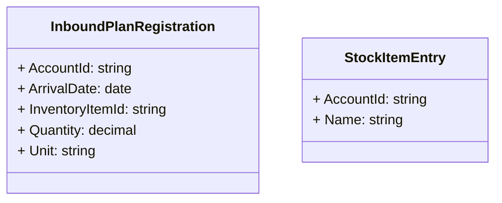

```mermaid
classDiagram

    class InboundPlanRegistration {
        + AccountId: string
        + ArrivalDate: date
        + InventoryItemId: string
        + Quantity: decimal
        + Unit: string
    }

    class StockItemEntry {
        + AccountId: string
        + Name: string
    }
```
