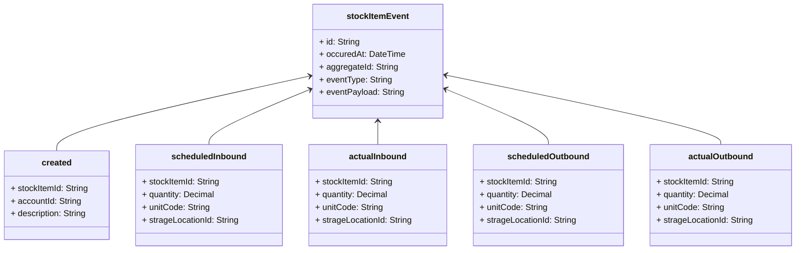

```mermaid
classDiagram
    stockItemEvent <-- created
    stockItemEvent <-- scheduledInbound
    stockItemEvent <-- actualInbound
    stockItemEvent <-- scheduledOutbound
    stockItemEvent <-- actualOutbound

    class stockItemEvent {
      + id: String
      + occuredAt: DateTime
      + aggregateId: String
      + eventType: String
      + eventPayload: String
    }

    class created {
      + stockItemId: String
      + accountId: String
      + description: String
    }

    class scheduledInbound {
      + stockItemId: String
      + quantity: Decimal
      + unitCode: String
      + strageLocationId: String
    }

    class actualInbound {
      + stockItemId: String
      + quantity: Decimal
      + unitCode: String
      + strageLocationId: String
    }

    class scheduledOutbound {
      + stockItemId: String
      + quantity: Decimal
      + unitCode: String
      + strageLocationId: String
    }

    class actualOutbound {
      + stockItemId: String
      + quantity: Decimal
      + unitCode: String
      + strageLocationId: String
    }

```
