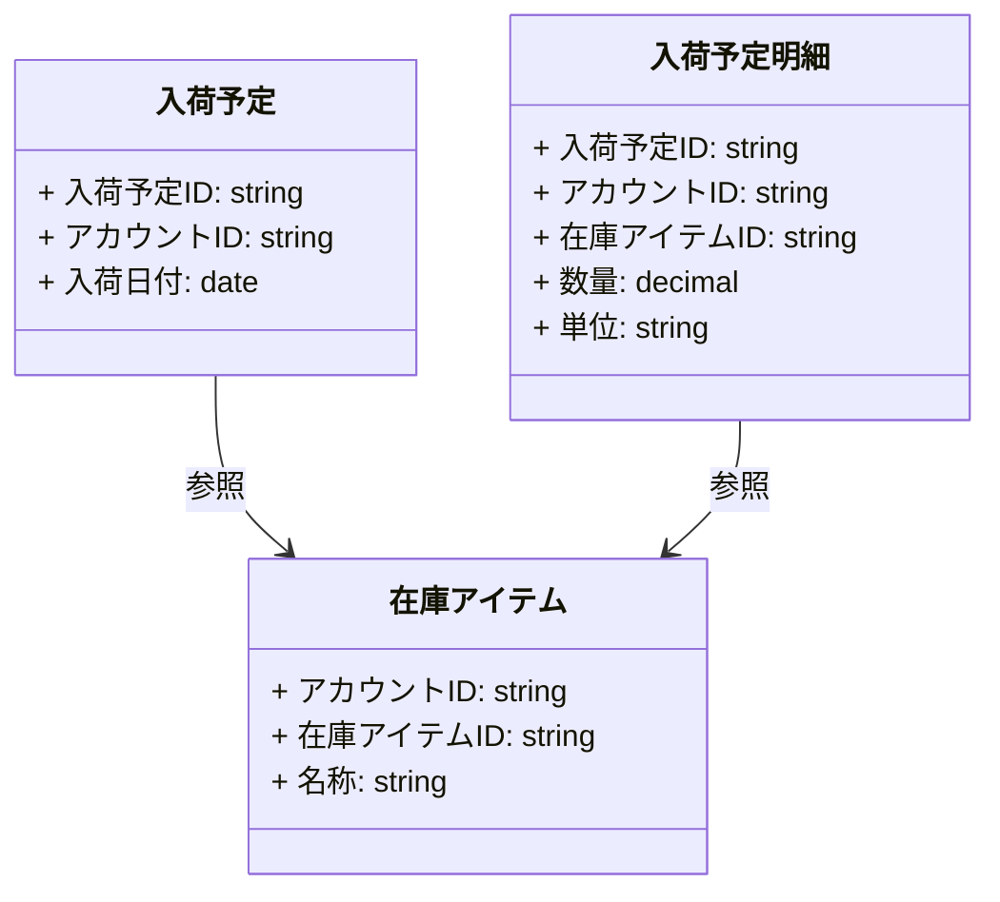

```mermaid
classDiagram
    class 入荷予定 {
        + 入荷予定ID: string
        + アカウントID: string
        + 入荷日付: date
    }
    class 入荷予定明細 {
        + 入荷予定ID: string
        + アカウントID: string
        + 在庫アイテムID: string
        + 数量: decimal
        + 単位: string
    }
    class 在庫アイテム {
        + アカウントID: string
        + 在庫アイテムID: string
        + 名称: string
    }

    入荷予定 --> 在庫アイテム: 参照
    入荷予定明細 --> 在庫アイテム: 参照
```
