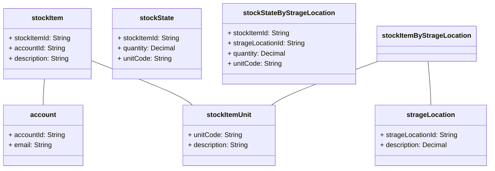

```mermaid
classDiagram
    class account {
      + accountId: String
      + email: String
    }

    class strageLocation {
      + strageLocationId: String
      + description: Decimal
    }

    class stockItem {
      + stockItemId: String
      + accountId: String
      + description: String
    }

    class stockState {
      + stockItemId: String
      + quantity: Decimal
      + unitCode: String
    }

    class stockStateByStrageLocation {
      + stockItemId: String
      + strageLocationId: String
      + quantity: Decimal
      + unitCode: String
    }

    class stockItemUnit {
      + unitCode: String
      + description: String
    }

    stockItem -- account
    stockItem -- stockItemUnit
    stockItemByStrageLocation -- strageLocation
    stockItemByStrageLocation -- stockItemUnit

```
