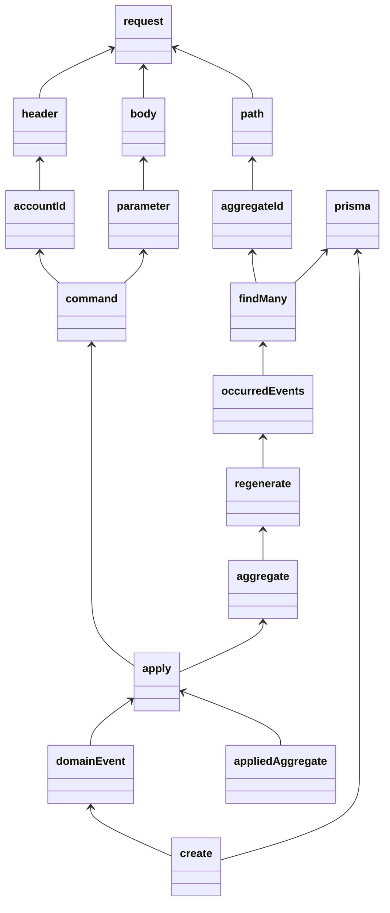

```mermaid
classDiagram
  request <-- path
  request <-- header
  request <-- body
  path <-- aggregateId
  header <-- accountId
  body <-- parameter
  accountId <-- command
  parameter <-- command
  command <-- apply
  aggregate <-- apply
  aggregateId <-- findMany
  prisma <-- findMany
  findMany <-- occurredEvents
  occurredEvents <-- regenerate
  regenerate <-- aggregate
  apply <-- domainEvent
  apply <-- appliedAggregate
  domainEvent <-- create
  prisma <-- create
```
